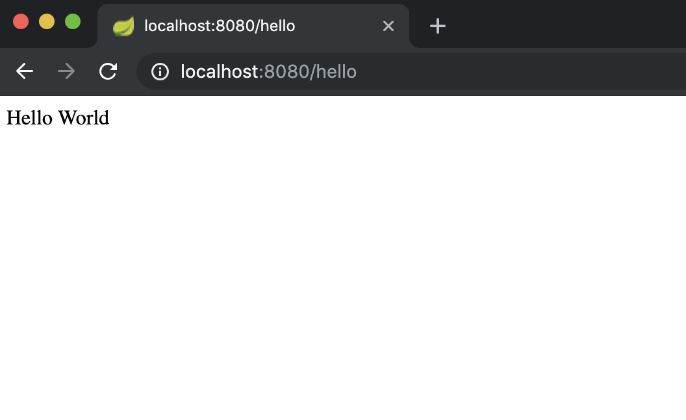

# Lab 1 Spring Boot

We are going to create a project using Spring Boot. Take a moment to think about how you have created projects in the past....

* Created from a random template on the internet?
* Copy and pasted from StackOverflow until something worked?
* Found a project within an organisation and used the same thing (just renaming a few things)

Our workshop starts with a empty folder. We are going to use [SpringInitalizr](<https://start.spring.io>) to create our project and get started.

If you have not completed the [pre-requisites](../prerequisites/README.md) please complete these steps first.

## Step 1 - Creating our First Controller

In the project we will create a small REST controller.
Spring boot works by scanning classes and looking for annotations it recognises.
Based on these annotations it will be opinionated and choose what it thinks the right set of configuration should look like.

Usually controllers would live in their own package, you should create the `TodosController.java` in your project.

```java
import org.springframework.web.bind.annotation.GetMapping;
import org.springframework.web.bind.annotation.RestController;

@RestController
public class TodosController {

    @GetMapping("/hello")
    public String helloWorld() {
        return "Hello World";
    }

}
```

We can now start our project by running `ApiworkshopApplication.java` (or the class which contains the main method).
In a couple of seconds you should be able to visit [http://localhost:8080/hello](http://localhost:8080/hello)



## Step 2 - Building a (slightly) more advanced API

We will create a very simple todo list application.
The application doesn't need to persist any data, though if you wanted to continue this exercise afterwards that is one extension point.

Here are the operations that we will look to implement:

* `GET /todos` Returns a list of todo items, initially the list will be empty
* `POST /todos` Creates a todo item
* `GET /todos/1` Returns the todo item with the ID 1
* `GET /todos?done=false` Returns a list of todo items, excluding those that are already done
* `DELETE /todos/1` Remove the todo item 1

### Design considerations

* You will need a POJO to represent the task (which contains an id and a description).
* You will need to explore the `@PathVariable` and `@RequestParam` annotations.
* You will probably want to factor out the Tasks features from the actual controller.
This will allow you to test independently.

You can test your API from your IDE or install a free tool like [Restlet](<https://chrome.google.com/webstore/detail/restlet-client-rest-api-t/aejoelaoggembcahagimdiliamlcdmfm?hl=en>)
into your browser.

### Step 3 (Optional) - Running as a Docker container

In order to build a docker container we first need to test running the application as a JAR locally.

To build a JAR file for your API run `mvnw package` from the command line. As a default it will be created the following location: `target/apiworkshop-0.0.1-SNAPSHOT.jar`

You can then run this JAR using: `java -jar target/apiworkshop-0.0.1-SNAPSHOT.jar`

As this is a Spring Boot application the JAR will have been packaged with everything your app needs to start your REST API.

The application will now be running and testable on <http://localhost:8080/todos>.

The following `Dockerfile` can now be created in the root of the project.

```docker
FROM eclipse-temurin:11
RUN mkdir /opt/app
COPY target/apiworkshop-0.0.1-SNAPSHOT.jar /opt/app/app.jar
CMD ["java", "-jar", "/opt/app/app.jar"]
```

The docker image can now be built with the following command:

`docker build -t apiworkshop:v1 .`

Once complete you can check the built image using `docker images`.

```shell
$ docker images
REPOSITORY                                            TAG                       IMAGE ID       CREATED         SIZE
apiworkshop                                           v1                        0a6ffb029f3c   2 minutes ago   467MB
```

You can now run a container based on the image using `docker run -p 8080:8080 -t apiworkshop:v1`

> Note the -p command sets up the port mapping.
> The app hosted at <http://localhost:8080/hello> will now be the docker version of your API.

You can view the running docker containers using `docker ps`

```shell
$ docker ps
CONTAINER ID   IMAGE            COMMAND                  CREATED          STATUS          PORTS                    NAMES
c917edd0e525   apiworkshop:v1   "java -jar /opt/app/…"   55 seconds ago   Up 55 seconds   0.0.0.0:8080->8080/tcp   frosty_colden
```

If you need to restart/stop the container run `docker kill <container ID>`.

### Step 4 (Optional) - Building with Docker

One limitation with our above solution is that we have to remember to build both with Maven and then with Docker.
This is both easy to forget and makes creating a build pipeline that bit more complex.

There is a solution and that is to utilise a Docker [multi-stage build](https://docs.docker.com/build/building/multi-stage/). This will allow us to use the `Dockerfile` to define how to both build the API and create a runnable image.

Apply the following updates to the `Dockerfile`:

```docker
FROM eclipse-temurin:17 as build

COPY .mvn .mvn
COPY mvnw .
COPY pom.xml .
COPY src src

RUN ./mvnw package

FROM eclipse-temurin:17

RUN mkdir /opt/app

COPY --from=build target/apiworkshop-0.0.1-SNAPSHOT.jar /opt/app/app.jar

ENTRYPOINT ["java", "-jar", "/opt/app/app.jar"]
```

The `Dockerfile` now consists of 2 stages represented by each of the `FROM` commands. There is an explicitly labelled `build` stage followed by an implicit run stage.

We can now run the image as we did in step 5, only this time when we run `docker build` it will both build the JAR and create the runnable docker image.

Containerizing builds provides a reproducible way of creating a docker image.
