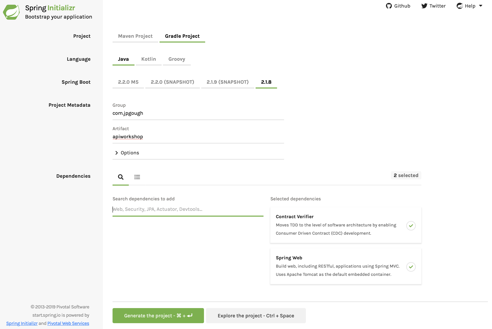

# Lab 1 Spring Boot

We are going to create a project using Spring Boot. Take a moment to think about how you have created projects in the past....

* Created from a random template on the internet?
* Copy and pasted from StackOverflow until something worked?
* Found a project within an organisation and used the same thing (just renaming a few things)

Our workshop starts with a empty folder. We are going to use [SpringInitalizr](https://start.spring.io) to create our project and get started.

### Step 1 - Generating the Project

* Visit [https://start.spring.io](https://start.spring.io) to create a new project
* Choose a gradle project for the lab
* We will use Java and the latest version of Spring Boot
* Create some project metadata that makes sense
* Add in the required dependencies, to get us started we will add
   * Cloud Contract Verifier (which we will use in Lab 2)
   * The Spring Web Starter dependency, which is required for tomcat to be embedded



Generating the project will download the dependencies and structure of a working Spring Application. 

### Step 2 - Importing the Project

#### Intellij

Import the project into your IDE by opening the the `build.gradle` file as a project.


On hitting OK the project will most likely download the internet (or at least all the required dependencies). 
Once this has completed your baseline project is ready. 
You can try running the tests to verify that your project builds and the context loads correctly.

#### Eclipse

File `->` Import `->` Gradle `->` Existing Gradle Project.    
Follow the wizard to bring in the project and resolve the dependencies.
 


Eclipse does not bring in JUnit by default, so you will need to add this.   
Right click on the project `->` Build Path `->` Configure Build Path   
Libraries `->` Add Library `->` JUnit 5 

### Step 3 - Creating our First Controller

In the project we will create a small REST controller. 
Spring boot works by scanning classes and looking for annotations it recognises.
Based on these annotations it will be opinionated and choose what it thinks the right set of configuration should look like.

Usually controllers would live in their own package, the `WorkshopController.java` below should be created in your project.

```java
import org.springframework.web.bind.annotation.RequestMapping;
import org.springframework.web.bind.annotation.ResponseBody;
import org.springframework.web.bind.annotation.RestController;

@RestController
public class WorkshopController {

    @RequestMapping("/hello")
    @ResponseBody
    public String helloWorld() {
        return "Hello World";
    }

}
```

We can now start our project by running `ApiworkshopApplication.java` (or the class which contains the main method). 
In a couple of seconds you should be able to visit [http://localhost:8080/hello](http://localhost:8080/hello)


### Step 4 - Building a (slightly) more advanced API

We will create a very simple todo list application.
The application doesn't need to persist any data, though if you wanted to continue this exercise afterwards that is one exetension point.

Here are the operations that we will look to implement:

* `GET /todo` Returns a list of todo items, initially the list will be empty
* `POST /todo/item/1` Creates a todo item with the ID 1
* `GET /todo/item/1` Returns the todo item with the ID 1
* `DELETE /todo/item/1` Remove the todo item 1

#### Design considerations

* You will need a POJO to represent the task (which contains an id and a description)
* You will need to explore the `@PathVariable` annotation
* You will probably want to factor out the Tasks features from the actual controller. 
This will allow you to test independently. 

You can test your API from your IDE or install a free tool like [Restlet](https://chrome.google.com/webstore/detail/restlet-client-rest-api-t/aejoelaoggembcahagimdiliamlcdmfm?hl=en) 
into your browser. 