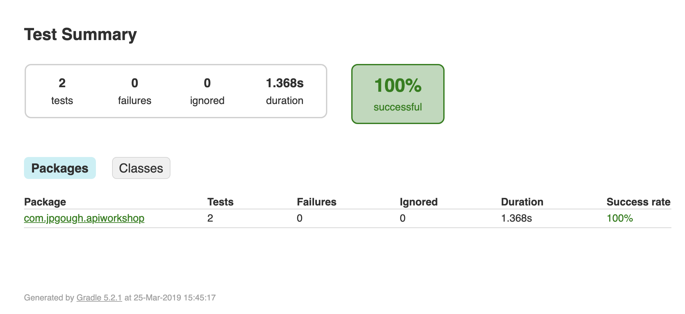

# Lab 2 Contracts

In lab 1 we created an API for tracking a todo list. 
One thing you may have felt whilst writing the code was the requirement to do manual testing.
In this lab we will explore writing Contract Driven Tests for our todo list application.
In an ideal world we would begin with the tests before writing the API code. 

#### Lab 1 Recap

Before we start it's important to scope what should have been done in lab 1 (in an ideal solution/world).

* Tasks should have been created as a service and unit tested for accuracy
* The Controller should have included tasks, and the behaviour we want to now test is the accuracy of the API.
* For contract tests we can (and normally would) completely mock out the service, 
given the simplicity of our service we will use the real thing. 

### Step 1 - Creating our First Contract

As always it's probably a good idea to commit the work from the previous lab if you have not already.
In our `build.gradle` you should see that we have the dependency for [Spring Cloud Contract](https://spring.io/projects/spring-cloud-contract).

`testImplementation 'org.springframework.cloud:spring-cloud-starter-contract-verifier'`

We are now going to setup our first contract:

* Create a folder called `resources` under the test directory
* Inside the `resources` directory create a directory called `contracts`, this is where our contract tests will live.
* Create our first contract inside the `contracts` folder

`task_list_is_empty.groovy`

```groovy
org.springframework.cloud.contract.spec.Contract.make {
    request {
        method 'GET'
        url '/todo'
    }
    response {
        status 200
        body([])
    }
}
```
The file represents a DSL specified in groovy for defining a contract. 
One of the first manual tests we performed in our previous lab was to check the tasks are initially empty. 

Now we have our contract we need to provide some setup to run this.

### Step 2 - Creating the Basis for the Test

We need to setup a class that knows which controller is the subject under test.
We can do this by creating a class called `MvcTest.java`, which we prepare to be the basis for running our contracts.

```java
package com.jpgough.apiworkshop;

import com.jpgough.apiworkshop.controller.WorkshopController;
import io.restassured.module.mockmvc.RestAssuredMockMvc;
import org.junit.Before;

public class MvcTest {

    @Before
    public void setup() {
        RestAssuredMockMvc.standaloneSetup(new WorkshopController());
    }

}
```

You will notice that this only contains a `@Before` annotation and no actual tests.
The tests are going to be generated from the contracts we have specified.
In order to generate those tests we need to configure a few items in the `gradle.build` file.

### Step 3 - Configuring the Build

The build configuration is a little bit clunky, but we need to add two new sections to the `build.gradle` file.

To the top of the file add the following buildscript node:

```groovy
buildscript {
	repositories {
		mavenCentral()
	}
	dependencies {
		classpath "org.springframework.boot:spring-boot-gradle-plugin:2.2.0.BUILD-SNAPSHOT"
		classpath "org.springframework.cloud:spring-cloud-contract-gradle-plugin:2.2.0.BUILD-SNAPSHOT"
	}
}
```

We also need to apply the Spring Cloud Contract Plugin, which we can do by adding the following line

```groovy
apply plugin: 'spring-cloud-contract'
```

The final step is to point to our base class for testing

```groovy
contracts {
	baseClassForTests = 'com.jpgough.apiworkshop.MvcTest'
	// fully qualified name to a class that will be the base class for your generated test classes
}
```

### Step 4 - Running the Tests and Checking the Output

The final step is to run the tests and view the results. 
We can do this by running `gradle test` and if everything works we should see a successful build.
In the directory `build/reports/tests/test` there is an `index.html` file that can be loaded in a browser to view the results of our tests.



The results show us our two tests, the config test provided from SpringInitializr and our new contract test.
We can drill into the test in more details.


In the directory `build/generated-test-sources` we can find the test that was generated and executed

```java
public class ContractVerifierTest extends MvcTest {

	@Test
	public void validate_task_list_is_empty() throws Exception {
		// given:
			MockMvcRequestSpecification request = given();

		// when:
			ResponseOptions response = given().spec(request)
					.get("/todo");

		// then:
			assertThat(response.statusCode()).isEqualTo(200);
		// and:
			DocumentContext parsedJson = JsonPath.parse(response.getBody().asString());
	}
}
```

It is worth keeping an eye on this folder as we go through the next part of the workshop. 
If a test doesn't work as expected you may have to take a look in this file to check the test is as expected. 
You can also execute the tests from this directory in your IDE.

It is also worth noting that this is using [Rest-assured](http://rest-assured.io) behind the scenes, another good mechanism for fine grain control when testing APIs. 

### Step 5 - Adding More Tests

Our `MvcTest.java` allows us to cover a lot of negative test cases.
When we use all the other requests we should see some failures.
Try and add tests for the following API edge cases:

* `GET todo/item/1` - Should return a 404, as an item does not exist
* `DELETE todo/item/1` - Should return a 404, as an item does not exist
* `POST todo/item/1` - Should return a 200 as the item does not exist


### Step 6 - Extensions

This extension is a little tricky as it now requires us to have a different starting state.
At this stage `MvcTest.java` should refactor to `EmptyTaskTest.java` and we need to create a new base class `ExistingTaskTest.java`

```java
public class ExistingTaskTest {

    private Tasks tasks = new Tasks();

    @Before
    public void setup() {
        tasks.addTask(1, new Task(1, "Existing"));
        RestAssuredMockMvc.standaloneSetup(new WorkshopController(tasks));
    }

}
```

It is possible to setup mappings to pick up different base classes for test types.
The documentation for this can be found [here](https://cloud.spring.io/spring-cloud-contract/spring-cloud-contract.html#gradle-different-base-classes).

The scenarios we can now test include

* Trying to add a task that already exists
* Getting tasks includes task 1
* Retrieval of task 1 succeeds with the description and a 200
* Task 1 can be removed successfully 

It is also possible to have multiple tests executed together in scenarios using Spring Cloud Contract. 