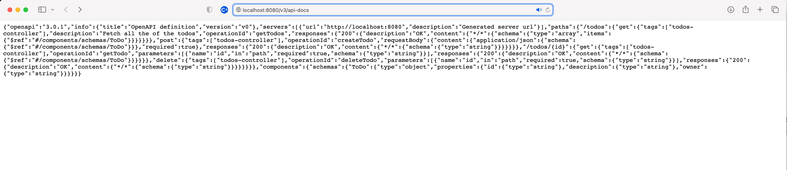

# Lab 3 OpenAPI

In lab 2 we started to add tests around the usage of our API to validate the shape and structure of our API.
During testing we may have realised we forgot a few edge cases and quickly corrected those.

In lab 3 we will now look at the OpenAPI specification of our API.

## Step 1 - Adding OpenAPI to our Project

[Swagger](https://swagger.io/about/) is the reference implementation where the [OpenAPI Specification](https://www.openapis.org) was founded and subsequently donated to the Linux foundation.

The [springdoc-openapi](https://springdoc.org) library exists that helps you to document your APIs with code as well as providing the Swagger UI.

To add springdoc-openapi to the project add the following dependency to the `pom.xml`:

```xml
<dependency>
  <groupId>org.springdoc</groupId>
  <artifactId>springdoc-openapi-ui</artifactId>
  <version>1.6.12</version>
</dependency>

```

## Step 2 - A closer look at the OpenAPI Spec and Swagger UI

If you then re-build and run the app the magic of this library and SpringBoot will result in a Swagger UI being available at <http://localhost:8080/swagger-ui.html> and the OpenAPI spec for the API being available at <http://localhost:8080/v3/api-docs>

### OpenAPI Spec

First let's look at the OpenAPI specification that has been generated for your application.

<http://localhost:8080/v3/api-docs>



### Swagger UI

Now take some time to explore the Swagger UI.

<http://localhost:8080/swagger-ui.html>


### Step 3 - Enhancing the OpenAPI spec

There are various annotations that can be used to customise and add further documentation to our code.

`@OpenAPIDefinition` - can sit at the top of the controller to give more information on the overall controller.
`@Operation` - can be used on the methods to provide more documentation

Experiment with those two annotations and see if you can produce a page that looks like the following.


You can find full docs related to the full range annotations available to document your APIs [here](https://github.com/swagger-api/swagger-core/wiki/Swagger-2.X---Annotations#quick-annotation-overview).

### Step 4 Generate a Client

An advantage of having the OpenAPI specification available is that we can now quite easily generating client code to call our API.

The JSON document found at <http://localhost:8080/v3/api-docs> represents our current API specification.

First, download [Swagger Codegen](https://swagger.io/tools/swagger-codegen/)

You can download the CLI as a JAR file directly from Maven Central as follows:

```sh
wget https://search.maven.org/remotecontent?filepath=io/swagger/codegen/v3/swagger-codegen-cli/3.0.36/swagger-codegen-cli-3.0.36.jar -O swagger-codegen-cli.jar

java -jar swagger-codegen-cli.jar --help
```

After you have downloaded the `swagger-codegen` CLI run the following command against your API specification.

```sh
java -jar swagger-codegen-cli.jar generate \
  -i http://localhost:8080/v3/api-docs\
  -l java \
  -o api-client
```

This will generate a Java client that you can use to experiment with calling your API.

There are many generators that are available, though you have to be careful that if you use one you do check the code generated.
Code generation has the potential to inject malicious code if it is not from a trusted source.

There are also some generators that build nicer Spring Boot projects [here](https://www.baeldung.com/spring-boot-rest-client-swagger-codegen).

Build a small Java command line app that operates with your Todo API.
