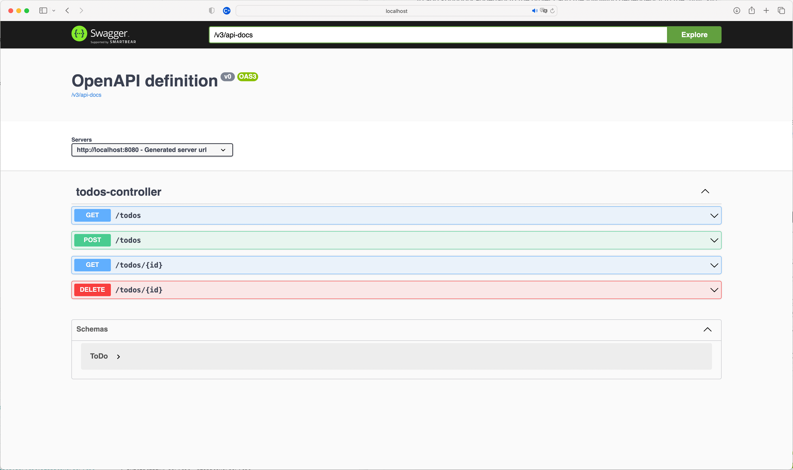

# Lab 3 OpenAPI

In lab 2 we started to add tests around the usage of our API to validate the shape and structure of our API.
During testing we may have realised we forgot a few edge cases and quickly corrected those.

In lab 3 we will now look at the OpenAPI specification of our API.

### Step 1 Adding Swagger to our Project

[Swagger](https://swagger.io/about/) is the reference implementation where the [OpenAPI Specification](https://www.openapis.org) was founded and subsequently donated to the Linux foundation. 
For working with Swagger there is a nice integration project with Spring Boot called [SpringFox](https://github.com/springfox/springfox).

Adding [SpringFox](https://github.com/springfox/springfox) to our project is quite straightforward, we need to add a new dependency to our `build.gradle`

```groovy
compile("org.springframework.plugin:spring-plugin-core:1.2.0.RELEASE")
compile("io.springfox:springfox-swagger2:2.9.2")
compile("io.springfox:springfox-swagger-ui:2.9.2")

```

> Note the need to baseline the `spring-plugin-core` this is due to Spring upgrading and SpringFox being slightly behind.
This should be resolved in the next release. 

The final step is to annotate the `Application.java` class to have the `@EnableSwagger2` annotation. 

```java
import springfox.documentation.swagger2.annotations.EnableSwagger2;

@SpringBootApplication
@EnableSwagger2
public class ApiworkshopApplication {
    //...
}
```

### Step 2 Looking at Swagger

On restarting our application we will now have some new endpoints. 
The first represents the swagger specification of our application.

[http://localhost:8080/v2/api-docs](http://localhost:8080/v2/api-docs)


The second represents the Swagger UI, which we can now use to invoke and explore our API. 
Note how we have every method on `/hello` as we didn't specify the request method before. 

[http://localhost:8080/swagger-ui.html](http://localhost:8080/swagger-ui.html)



The `basic-error-controller` is some noise from Spring and we can reduce that noise by adding the following configuration bean.

```java
@Bean
public Docket api() {
    return new Docket(DocumentationType.SWAGGER_2)
            .select()
            .apis(RequestHandlerSelectors.any())
            .apis(Predicates.not(RequestHandlerSelectors.basePackage("org.springframework.boot")))
            .apis(Predicates.not(RequestHandlerSelectors.basePackage("org.springframework.cloud")))
            .apis(Predicates.not(RequestHandlerSelectors.basePackage("org.springframework.data.rest.webmvc")))
            .paths(PathSelectors.any())
            .build();
}
```

This bean can be added to a separate Spring Configuration class or into the `Application.java` file with an `@Configuration` annotation.
If we also specify `/hello` as a `GET` we will see our specification looks a lot tidier. 


### Step 3 More tidying

There are some other annotations that can be used to add further documentation to our code.

`@Api` - can sit at the top of the controller to give more information on the overall controller.  
`@ApiOperation` - can be used on the methods to provide more documentation

Experiment with those two annotations and see if you can produce a page that looks like the following.


### Step 4 Generate a Client

The advantage of having the swagger specification available is generating client code to call our API is now quite easy.
[http://localhost:8080/v2/api-docs](http://localhost:8080/v2/api-docs) represents our current API specification.
 
First, download [Swagger Codegen](https://github.com/swagger-api/swagger-codegen)

```
wget http://central.maven.org/maven2/io/swagger/swagger-codegen-cli/2.3.1/swagger-codegen-cli-2.3.1.jar -O swagger-codegen-cli.jar   
java -jar swagger-codegen-cli.jar help
```
On a mac you can also run `brew install swagger-codegen`. 
After you have downloaded `swagger-codegen` run the following command against your API specification. 

```
java -jar swagger-codegen-cli.jar generate \
  -i http://localhost:8080/v2/api-docs\
  -l java \
  -o com/jpgough/workshop/java
```

This will generate a Java client that you can now experiment with calling your API.

There are many generators that are available, though you have to be careful that if you use one you do check the code generated.
Code generation has the potential to inject malicious code if it is not from a trusted source. 
The are also some generators that build nicer Spring Boot projects [here](https://www.baeldung.com/spring-boot-rest-client-swagger-codegen).

Build a small Java command line app that operates with your Todo API. 