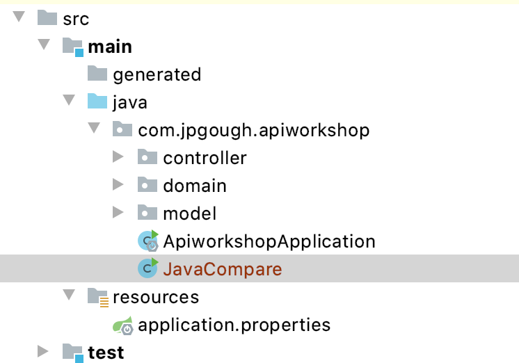
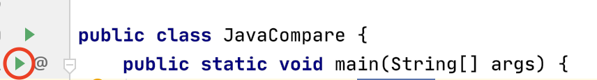
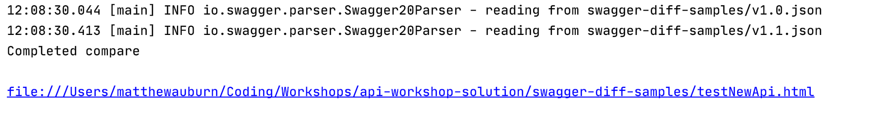
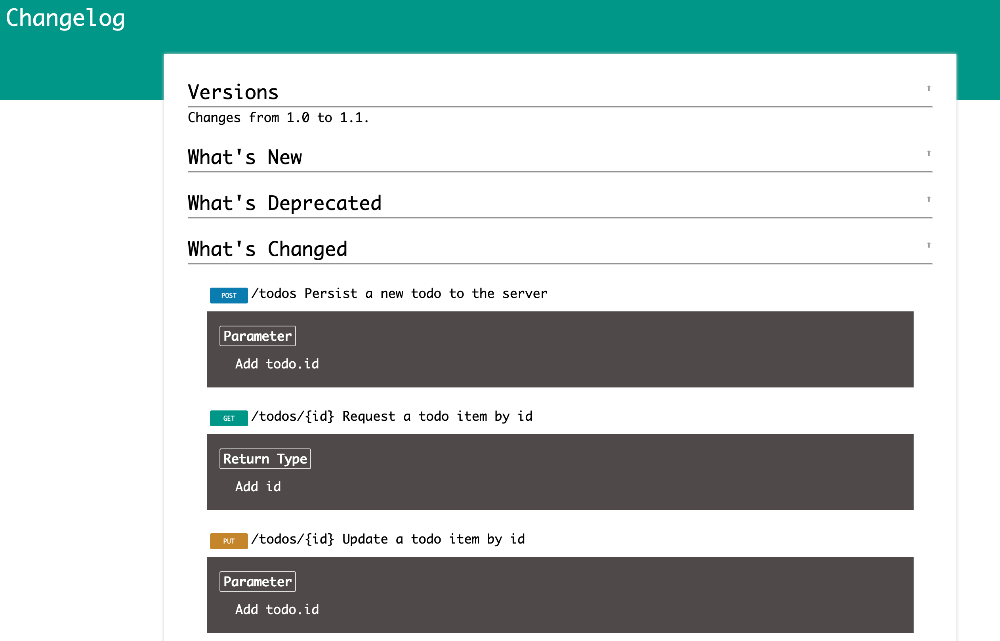
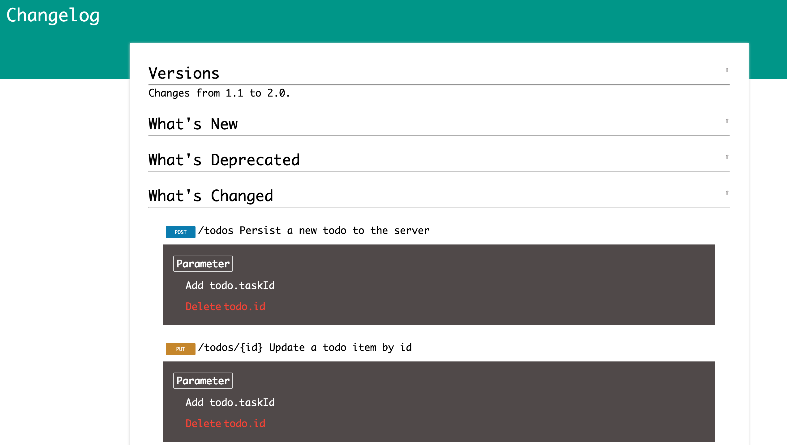

# Lab 4 Versioning

In Lab 3 we explored API specifications and generating code against those specifications.
Unlike when we use a binary dependency there is the opportunity for APIs to evolve in a decoupled way.
The issue with this is the possibility of software dependencies unexpectedly breaking.

Versioning can help us to prevent issues, in this lab we will explore how changes to our API either retain or break backwards compatibility.

## Step 1

Add a new dependency to your java project. This dependency pulls in a Java library from the project <http://deepoove.com/swagger-diff/> which can be used to compare swagger files.

```groovy
dependencies {
//    Swagger diff
    compile group: 'com.deepoove', name: 'swagger-diff', version: '1.2.1'

    ...
}
```

Create a new Java class to use the Swagger diff. Create this in the root of your Java application and call it JavaCompare. e.g.



Add the code to the newly created class:

```java
import com.deepoove.swagger.diff.SwaggerDiff;
import com.deepoove.swagger.diff.output.HtmlRender;

import java.io.FileWriter;
import java.io.IOException;
import java.nio.file.Paths;

public class JavaCompare {
    public static void main(String[] args) {
        String oldSpec = "v1.0.json";
        String newSpec = "v1.1.json";
        final var swaggerDiff = SwaggerDiff.compareV2(oldSpec, newSpec);
        String html = new HtmlRender("Changelog",
                "http://deepoove.com/swagger-diff/stylesheets/demo.css")
                .render(swaggerDiff);
        try {
            FileWriter fw = new FileWriter(
                    "testNewApi.html");
            fw.write(html);
            fw.close();
            System.out.println("Completed compare");
            System.out.println();
            System.out.println("file://"+ Paths.get("testNewApi.html").toAbsolutePath().toString());
            System.out.println();
        } catch (IOException e) {
            e.printStackTrace();
        }
    }
}
```

## Step 2

If your service is not running currently, launch it and then make a copy of the API specification as it currently stands.

```shell
curl http://localhost:8080/v2/api-docs -o v1.0.json
```

Make a small refactor to the API and add a field representing the todo owner.
This can simply be added into the Java object as an additional optional field. e.g.

```java
private Integer id;
public Integer getId() {return id;}
public void setId(Integer id) {this.id = id;}
```

Restart the application and capture the specification again

```shell
curl http://localhost:8080/v2/api-docs -o v1.1.json
```

In the directory you are working in you should now have two files

```shell
$ ls
v1.0.json v1.1.json
```

We will now inspect the compatibility of these two files using the Swagger Diff class that we created.

Ensure that the variables `oldSpec` and `newSpec` is the relative path to the files that are created when running the curl request.

To run the compare press the green play button on the class and a file path will be produced. This is the location of the swagger compare.

Here we see the green play button to run the compare



This next image is the output of the comparison as an HTML file. Copy and paste this into your browser to see the difference



## Step 3

Examine the HTML file and you can see a breakdown of what has changed in between each version



## Step 4

Lets now try and break compatibility in the API. 
For this change rename the id to be taskID, restart the application and then run `curl http://localhost:8080/v2/api-docs -o v2.0.json`.

Rerun `swagger-diff` and observe the output.



## Step 5

Read through the information about Major and Minor versioning on APIs in this great document by [PayPal](https://github.com/paypal/api-standards/blob/master/api-style-guide.md#api-versioning).
