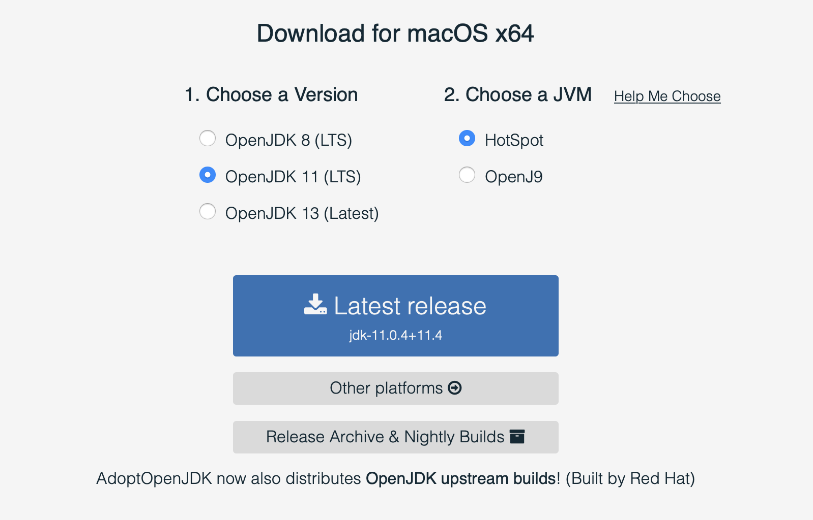
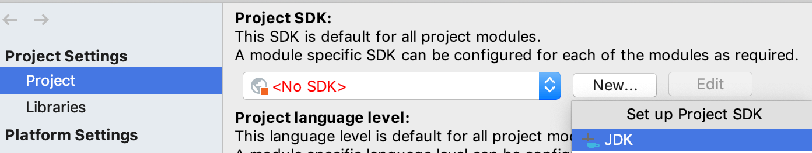
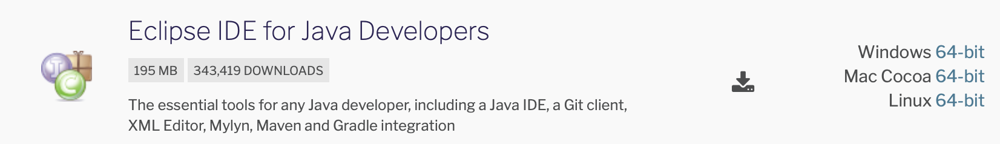
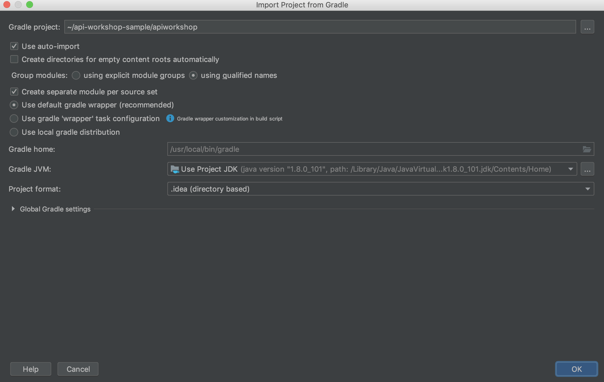
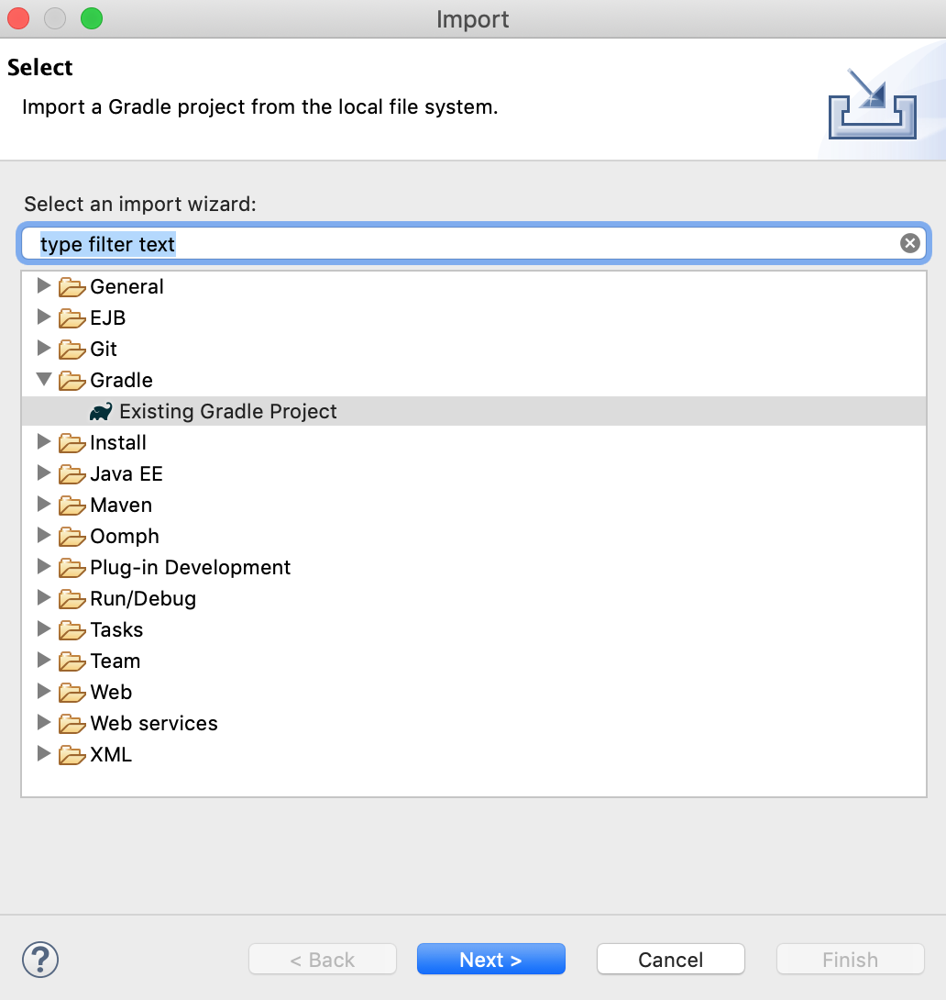

# Prerequisites

The workshop requires that you download some applications to be able to complete the tasks on the day.
You should do these tasks before the workshop as some of the files are large.

The tasks that will be the following

* Download Java SDK
* Install one of the following IDE's, Intellij/Eclipse, IntelliJ is recommended
* Download the baseline project for the labs

## Downloading Java SDK

* Visit https://adoptopenjdk.net

* Select Java version 11, Hotspot and then Download.
   

* Next follow the steps to install the package you have downloaded.
  * Windows - [Install page](https://adoptopenjdk.net/installation.html?variant=openjdk11&jvmVariant=hotspot#windows-msi)
  * Mac - [Install page](https://adoptopenjdk.net/installation.html?variant=openjdk11&jvmVariant=hotspot#macos-pkg)

## Install and IDE

The next stage is to install an IDE

### IntelliJ - Recommended

* Visit https://www.jetbrains.com/idea/download/#section=mac
* Select the Ultimate or Community Edition and download. Ultimate has a 30 day trial which is nice to use if you have a free trial available. Community Edition is missing a few features from Ultimate but none that matter for this workshop and is completely free
  * Windows - Run the downloaded EXE file
  * Mac - Run the downloaded PKG file
* Configure the SDK
  * Open intelliJ and select File -> Project Structure
  * Notice the **No SDK** which can be seen in the image
  
  * Select New -> JDK
  * Navigate to your installed Java SDK
    * Windows - c:\Program Files\AdoptOpenJDK\\***version-downloaded***
    * Mac - /Library/Java/JavaVirtualMachines/***version-downloaded***/Contents/Home

### Eclipse

* Visit https://www.eclipse.org/downloads/packages/
* Find the "Eclipse IDE for Java Developers" and download the version for you operating system

  * Windows - Unzip the downloaded zip folder and run the eclipse.exe file
  * Mac - Open the DMG file and eclipse will install

## Baseline project for the labs

In order to save time during the workshop it would useful for you to download the baseline SpringBoot project and cache some of dependencies that will be needed for the labs.

### Download SpringBoot project

The following URL is pre-configured to take you directly to https://start.spring.io and download a zip file containing the project. Just open your browser and enter the URL, the download should begin.

`https://start.spring.io/#!type=gradle-project&language=java&platformVersion=2.2.4.RELEASE&packaging=jar&jvmVersion=11&groupId=com.jpgough&artifactId=apiworkshop&name=apiworkshop&description=Starter%20api%20workshop%20project&packageName=com.jpgough.apiworkshop&dependencies=web,cloud-contract-verifier`

Unzip the downloaded archive to a location on your file system.

### Import project into you IDE

Import the project into IntelliJ by opening the the `build.gradle` file as a project.



On hitting OK the project will most likely download the internet (or at least all the required dependencies).
Once this has completed your baseline project is ready.
You can try running the tests to verify that your project builds and the context loads correctly.

### Eclipse

File `->` Import `->` Gradle `->` Existing Gradle Project.
Follow the wizard to bring in the project and resolve the dependencies.



### Verify it works

You will need to make some changes to the build.gradle file to allow it to work from the beginning.
The setup for Spring Cloud Contracts which will be discussed in [02-contracts](02-contracts/README.md) needs a little change.

In the build.gradle file overwrite the small sction called `contracts` to the following:

```groovy
contracts {
  testFramework = org.springframework.cloud.contract.verifier.config.TestFramework.JUNIT5
  failOnNoContracts = false
}
```

Now simply run `gradlew test` from the command line to verify that the base project works as expected.

## Optional

The following additional installations allow you to complete all the workshop extension tasks. You do not have to install them to complete the core of this workshop.

### A REST client

We will be making requests to the services we build so it is really useful to have a rest client. Please use any of the suggested options:

* In IntelliJ there is one available in Tools -> HTTP Client -> Test RESTful Web Service
* For Windows or Mac [POSTman](https://www.getpostman.com/downloads/)
* For chrome [restlet client](https://chrome.google.com/webstore/detail/restlet-client-rest-api-t/aejoelaoggembcahagimdiliamlcdmfm?hl=en)

### Docker

We next need to install Docker. First it is necessary to create a Docker account.

* To create a Docker account visit the following website and register: https://hub.docker.com/signup

* Next depending on your system you will need to choose the Docker version to install

  * For **Windows 10 Home Edition** you will need to install the legacy [Docker Toolbox](https://docs.docker.com/toolbox/toolbox_install_windows/). The instructions can be found [here](https://docs.docker.com/toolbox/toolbox_install_windows/) and are indepth so should be followed carefully

  * For **Mac** or **any other Windows Edition** Visit https://hub.docker.com/?overlay=onboarding
    * Follow the first step to download Docker for your operating system
    * Run the downloaded file
      * Windows run the EXE file
      * Mac run the DMG file
    * If you wish continue with the rest of the docker guide, however, it is not important

### Docker images

As part of the workshop we will require the downloading of some docker images. These can be quite large so to save time it may be simpler to download these now

* Open a cli
  * Windows - Powershell
  * Mac - terminal
* Execute the following commands

```docker
docker pull postgres:latest
docker pull dius/pact-broker:latest
docker pull jpgough/api-workshop-gateway
docker pull gradle:jdk11
```

